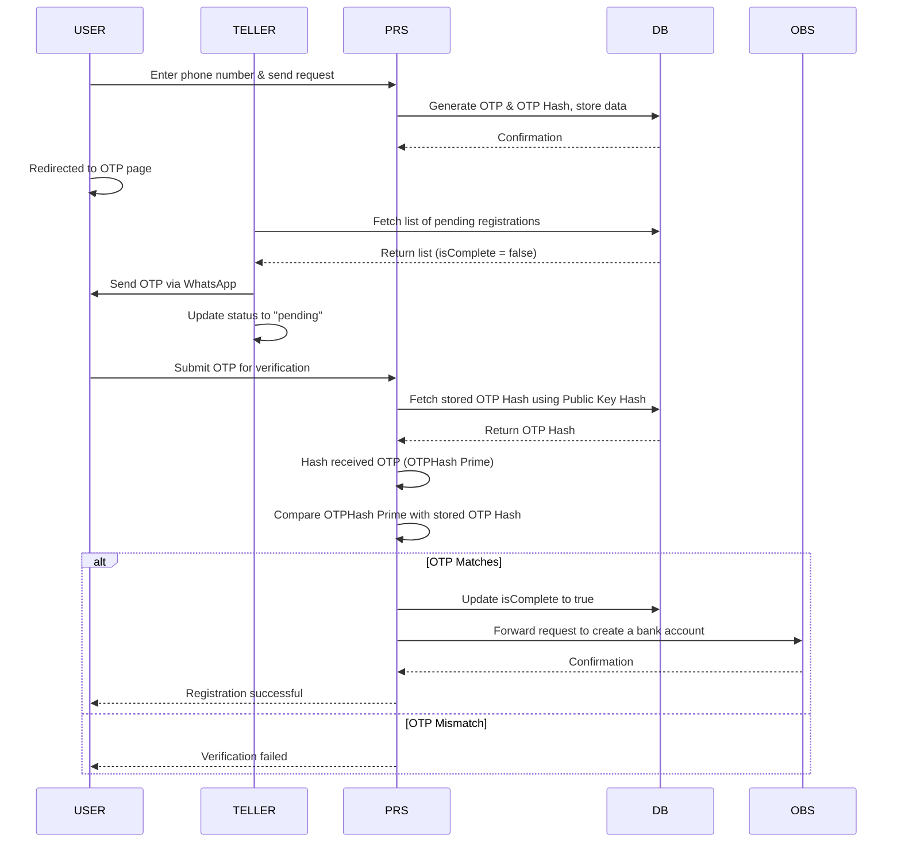

# OTP Verification Process Requirement Document

## Table of Contents
- [OTP Verification Process Requirement Document](#otp-verification-process-requirement-document)
    - [Table of Contents](#table-of-contents)
    - [1. Introduction](#1-introduction)
    - [2. High-Level System Architecture](#2-high-level-system-architecture)
    - [3. OTP Verification Workflow](#3-otp-verification-workflow)
        - [3.1. User OTP Request](#31-user-otp-request)
        - [3.2. Teller OTP Processing](#32-teller-otp-processing)
        - [3.3. User OTP Verification](#33-user-otp-verification)
    - [4. Security Considerations](#4-security-considerations)
        - [4.1. OTP Data Security](#41-otp-data-security)
        - [4.2. API Authentication and Authorization](#42-api-authentication-and-authorization)
        - [4.3. OTP Transmission Security](#43-otp-transmission-security)
    - [5. Error Handling](#5-error-handling)
    - [7. Sequence Diagram](#7-sequence-diagram)
    - [8. Database Schema](#8-database-schema)
    - [9. Glossary of Terms](#9-glossary-of-terms)
    - [10. Version History](#10-version-history)
    - [11. Conclusion](#11-conclusion)

## 1. Introduction
The OTP (One-Time Password) verification process ensures secure user onboarding by validating phone numbers before account creation. This document details the workflow, system architecture, security considerations, error handling, and scalability.

## 2. High-Level System Architecture
The system consists of the following entities:
- **USER**: Initiates registration and OTP verification.
- **TELLER**: Sends OTPs manually via WhatsApp and updates the OTP status.
- **PRS (Pending Registration Service)**: Generates OTPs, handles validation, and interacts with OBS.
- **DB (Database)**: Stores OTP-related data and user information.
- **OBS (Online Banking Service)**: Finalizes account creation after successful OTP verification.

## 3. OTP Verification Workflow

### 3.1. User OTP Request
1. User enters their phone number and clicks the **Send OTP** button.
2. User is redirected to the OTP input page.
3. The request is sent to the **PRS**, which generates an OTP.
4. PRS stores the OTP data in the **DB** with the following fields:
    - Phone Number
    - Public Key (Hashed, used as index)
    - OTP Hash
    - OTP Generated
    - "IsComplete" Field (Initially `false`)

### 3.2. Teller OTP Processing
1. The Teller logs into their application.
2. The system loads a list of pending OTPs from the **DB** where `IsComplete = false`.
3. For each phone number, the Teller:
    - Sends the OTP to the user via WhatsApp.
    - Updates the status by clicking a **Pending** button.

### 3.3. User OTP Verification
1. The User receives the OTP on WhatsApp and enters it into the application.
2. The OTP is sent to **PRS** for validation.
3. PRS:
    - Hashes the received OTP (OTPHASH PRIME).
    - Hashes the received Public Key.
    - Retrieves the stored OTP Hash from **DB**.
    - Compares OTPHASH PRIME with the stored OTP Hash.
4. If they match:
    - PRS updates `IsComplete = true` in the **DB**.
    - PRS forwards the request to **OBS** to create the user’s bank account.
5. If verification fails, an error message is sent to the user.

## 4. Security Considerations
### 4.1. OTP Data Security
- OTPs are stored as **hashes**, never in plaintext.
- Public Keys are **hashed** before storage.
- OTP expiry mechanisms prevent replay attacks.
- Limit the number of OTP attempts to mitigate brute-force attacks.
- Implement logging and monitoring for suspicious activities.

### 4.2. API Authentication and Authorization
- PRS and OBS communicate using **JWT authentication**.
- Database access is **restricted to authorized services only**.
- Enforce role-based access control (RBAC) for different entities.
- Use rate limiting to prevent API abuse.

### 4.3. OTP Transmission Security
- All API communication is secured with **TLS 1.3**.
- Tellers do not see the full OTPs in plaintext.
- Encrypt OTP transmission over WhatsApp where possible.

## 5. Error Handling

- **Invalid OTPs**:  
  Users can retry a limited number of times before being temporarily blocked.  
  **Error Message:** `"Invalid OTP. Please try again. X attempts remaining."`

- **Expired OTPs**:  
  Users are prompted to request a new OTP.  
  **Error Message:** `"Your OTP has expired. Request a new one to proceed."`

- **Too Many OTP Attempts**:  
  If users exceed the retry limit, they are temporarily blocked.  
  **Error Message:** `"Too many incorrect attempts. Please wait X minutes before trying again."`

- **Database Failures**:  
  Implement retry mechanisms with exponential backoff. If the issue persists, display an error message.  
  **Error Message:** `"A temporary issue occurred. Please try again later."`

- **Network Issues**:  
  If there is a connectivity problem, prompt users to check their connection.  
  **Error Message:** `"Network error detected. Please check your connection and try again."`

- **Rate Limiting Exceeded**:  
  If a user sends too many OTP requests, they must wait before trying again.  
  **Error Message:** `"You have exceeded the allowed number of OTP requests. Try again after X minutes."`

- **Service Downtime**:  
  If the OTP service is unavailable, inform users and suggest trying later.  
  **Error Message:** `"Service is temporarily unavailable. Please try again later."`

## 7. Sequence Diagram

## 8. Database Schema
| Table | Column | Type | Description |
|-------|--------|------|-------------|
| otp_requests | id | UUID | Unique ID for OTP request |
| | phone_number | VARCHAR(20) | User's phone number |
| | public_key_hash | TEXT | Hashed public key |
| | otp_hash | TEXT | Hashed OTP value |
| | otp_generated | TEXT | OTP generated |
| | is_complete | BOOLEAN | Status of OTP verification |

## 9. Glossary of Terms
- **PRS**: Pending Registration Service
- **OBS**: Online Banking Service
- **OTP**: One-Time Password

## 10. Version History
| Version | Date       | Changes        |
|---------|------------|----------------|
| 1.1     | 2025-03-13 | Security updates, Mermaid diagram added, DB schema included |

## 11. Conclusion
This document outlines a **secure, scalable, and efficient** OTP verification process. Future improvements include **automated OTP delivery** and **biometric verification** as an alternative to OTPs.

