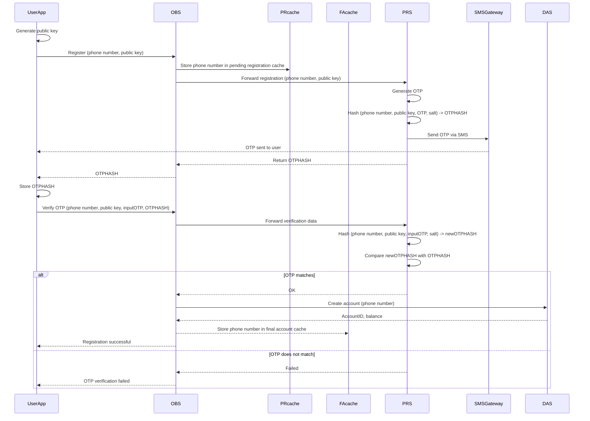

# **PRS (Pending Registration Service) Architecture Documentation**

### **Table of Contents**
- [**PRS (Pending Registration Service) Architecture Documentation**](#prs-pending-registration-service-architecture-documentation)
  - [**1. Introduction**](#1-introduction)
  - [**2. High-Level System Architecture**](#2-high-level-system-architecture)
  - [**3. Registration Workflow**](#3-registration-workflow)
  - [**4. Interaction with Other Modules**](#4-interaction-with-other-modules)
  - [**5. Data Flow and Sequence Diagram**](#5-data-flow-and-sequence-diagram)
  - [**6. Security Considerations**](#6-security-considerations)
  - [**7. Conclusion**](#7-conclusion)

---

### **1. Introduction**

The **Pending Registration Service (PRS)** is a critical backend service within the Webank system, tasked with managing user registrations and OTP verification. It ensures a secure and seamless process for new users signing up for bank accounts by integrating with the **OBS (Online Banking Service)**, an **SMS gateway service**, and other key modules.

**NOTE**: This document will focus on the PRS and its role as a backend module in the architecture of webank. For the documentation rcovering the overall backend of webank see [here](https://github.com/ADORSYS-GIS/webank-OnlineBanking/blob/main/Docs/Architecture.md#obs-backend-architecture-documentation)

**Key Responsibilities:**
- Generate and manage OTPs during registration.
- Securely hash and validate user-provided registration data.
- Facilitate communication between the frontend and backend for user account creation.

---

### **2. High-Level System Architecture**

The PRS operates within a microservices ecosystem and is tightly integrated with the OBS and SMS Gateway. It performs the following key functions:

1. **OTP Generation and Delivery**: Generates unique OTPs for each registration attempt and sends them via SMS to the user.
2. **Hashing and Validation**: Implements secure hashing logic to prevent replay attacks or tampering during OTP verification.
3. **Communication**: Acts as the processing layer for requests originating from the OBS during the user registration process.

---

### **3. Registration Workflow**

#### **Step-by-Step Process**

1. **Frontend Registration Request**:
    - A user accesses the registration page in the **UserApp** and provides their phone number.
    - The app generates a public key for the user and sends a request containing the phone number and public key to the **OBS**, the designated entry point for backend services.

2. **Pending Registration Cache**:
    - The **OBS** temporarily stores the phone number in a **pending registration cache (PR cache)** to prevent spamming of registration requests. 
    - Any repeat requests from the same phone number within 5 minutes are ignored.

3. **Request Forwarded to PRS**:
    - The OBS forwards the phone number and public key to the PRS.

4. **OTP Generation and Hashing**:
    - The PRS generates a unique OTP and hashes the incoming data (phone number, public key, OTP) with a salt. 
    - This produces an **OTPHASH** that is sent back to the frontend as part of the response.
    - The OTP is forwarded to the user via an SMS Gateway.

5. **Frontend OTP Confirmation**:
    - The user receives the OTP and enters it in the **UserApp**’s OTP confirmation page.
    - The app sends a new request containing the phone number, public key, OTP, and OTPHASH to the OBS.

6. **Verification in PRS**:
    - The OBS forwards the data to the PRS, which hashes the phone number, public key, and OTP again with the same salt to generate a **newOTPHASH**.
    - If the **newOTPHASH** matches the original **OTPHASH**, the PRS sends an **OK** response back to the OBS.

7. **Account Creation**:
    - Upon successful OTP verification, the OBS communicates with the DAS (Deposit Account Service) to create the user's bank account.
    - The phone number is stored in a **final account cache (FA cache)** in the OBS to avoid repeated queries to the DAS.

---

### **4. Interaction with Other Modules**

#### **1. OBS (Online Banking Service)**:
- Acts as the gateway for registration requests and forwards them to the PRS.

#### **2. SMS Gateway**:
- Sends OTPs generated by the PRS to the user's phone number.

#### **3. DAS (Deposit Account Service)**:
- Creates the user’s bank account upon successful OTP verification.

---

### **5. Data Flow and Sequence Diagram**

#### **Data Flow**

1. The user initiates the registration process in the frontend.
2. The OBS manages caching and forwards requests to the PRS.
3. The PRS generates OTPs, hashes the registration data, and validates OTPs upon verification.

#### **Sequence Diagram**

---

### **6. Security Considerations**

- **Hashing with Salt**: Adds an extra layer of security to prevent brute-force attacks.
- **Caching**: Prevents spamming of registration requests.
- **OTP Validation**: Ensures the user has access to the registered phone number.
- **HTTPS Encryption**: Protects sensitive data during transmission.

---

### **7. Conclusion**

The PRS is an integral part of the Webank backend, designed to ensure secure, efficient, and user-friendly account registration.

