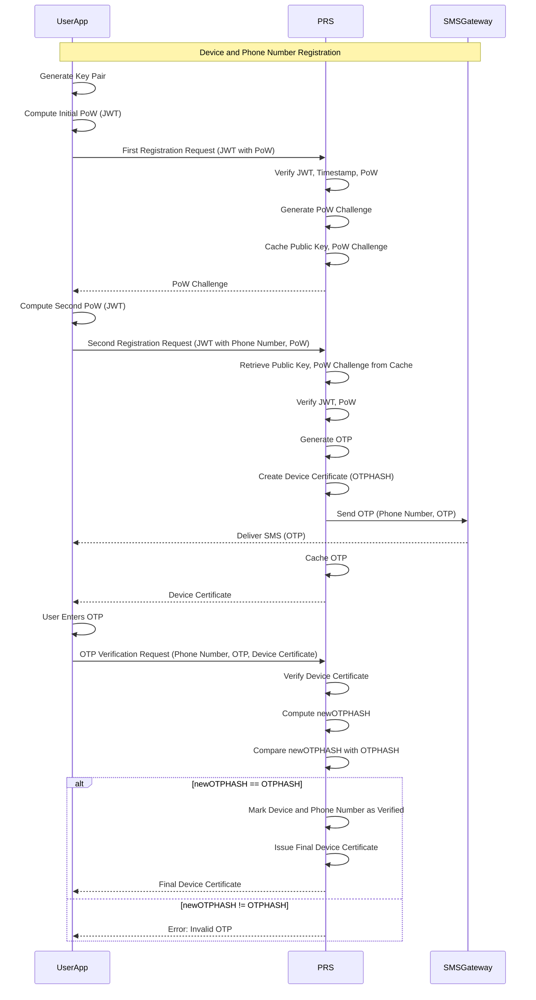
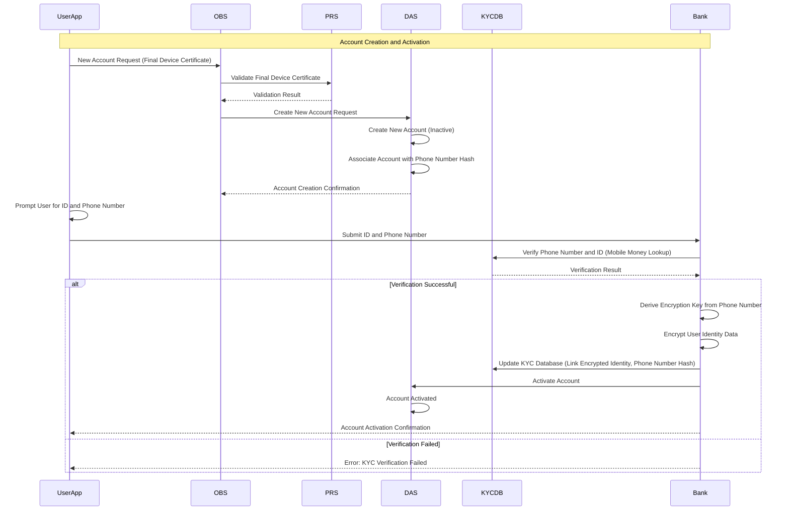
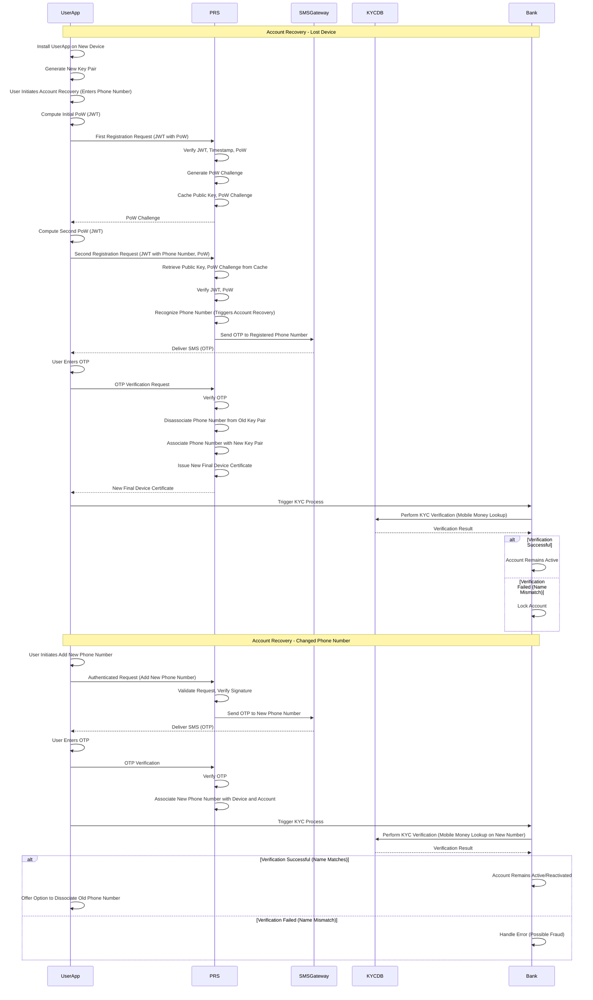
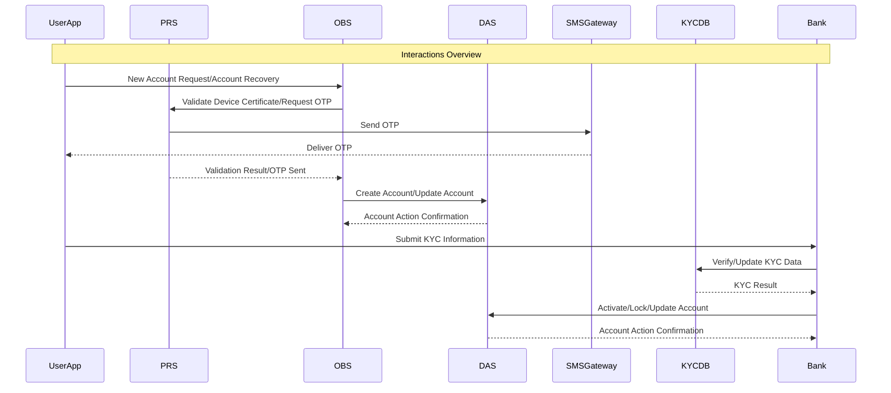

# **PRS (Pending Registration Service) Architecture Documentation**

### **Table of Contents**

  * [1. Introduction](#1-introduction)
  * [2. High-Level System Architecture](#2-high-level-system-architecture)
  * [3. Registration Workflow](#3-registration-workflow)
      * [3.1. Device and Phone Number Registration](#31-device-and-phone-number-registration)
      * [3.2. Account Creation and Activation](#32-account-creation-and-activation)
      * [3.3. Account Recovery](#33-account-recovery)
  * [4. Interaction with Other Modules](#4-interaction-with-other-modules)
      * [4.1. Online Banking Service (OBS)](#41-online-banking-service-obs)
      * [4.2. Deposit Account Service (DAS)](#42-deposit-account-service-das)
      * [4.3. SMS Gateway](#43-sms-gateway)
      * [4.4. KYC Database](#44-kyc-database)
  * [5. Security Considerations](https://www.google.com/url?sa=E&source=gmail&q=#5-security-considerations)
      * [5.1. Salt Management](https://www.google.com/url?sa=E&source=gmail&q=#51-salt-management)
      * [5.2. OTP Generation](https://www.google.com/url?sa=E&source=gmail&q=#52-otp-generation)
      * [5.3. Public Key Usage](https://www.google.com/url?sa=E&source=gmail&q=#53-public-key-usage)
      * [5.4. Proof-of-Work Challenge Management](https://www.google.com/url?sa=E&source=gmail&q=#54-proof-of-work-challenge-management)
  * [6. Caching Mechanisms](https://www.google.com/url?sa=E&source=gmail&q=#6-caching-mechanisms)
      * [6.1. PoW Challenge Cache](https://www.google.com/url?sa=E&source=gmail&q=#61-pow-challenge-cache)
      * [6.2. OTP Cache](https://www.google.com/url?sa=E&source=gmail&q=#62-otp-cache)
      * [6.3. Device Certificate Cache](https://www.google.com/url?sa=E&source=gmail&q=#63-device-certificate-cache)
  * [7. Error Handling](https://www.google.com/url?sa=E&source=gmail&q=#7-error-handling)
  * [8. Scalability](https://www.google.com/url?sa=E&source=gmail&q=#8-scalability)
  * [9. Glossary of Terms](https://www.google.com/url?sa=E&source=gmail&q=#9-glossary-of-terms)
  * [10. Version History](https://www.google.com/url?sa=E&source=gmail&q=#10-version-history)
  * [11. Conclusion](https://www.google.com/url?sa=E&source=gmail&q=#11-conclusion)

-----

## **1. Introduction**

The **Pending Registration Service (PRS)** is a critical backend service within the Webank system responsible for managing the secure and efficient registration of new users, their devices, and mobile phone numbers. It acts as a gatekeeper for new accounts, ensuring that only legitimate users with verified devices and phone numbers can access the Online Banking Service (OBS).

**Key Responsibilities and Enhancements:**

  * **Proof-of-Work (PoW) Implementation:** Implements robust PoW mechanisms using JWTs to deter spam and ensure that registration requests originate from legitimate UserApps.
  * **Secure Device Registration:** Registers unique device key pairs and binds them to user accounts through signed device certificates, enhancing security and enabling device-specific authorization.
  * **OTP Verification:** Generates, sends, and verifies One-Time Passwords (OTPs) via an SMS gateway to associate mobile phone numbers with registered devices and user accounts.
  * **Account Recovery:** Facilitates account recovery through OTP verification when users lose their device or change phone numbers.
  * **Integration with KYC:** Integrates with a KYC (Know Your Customer) process to validate the user's identity and link it to their mobile phone number and bank account.
  * **Support for Multiple Phone Numbers:** Allows users to register multiple phone numbers (e.g., from different SIM cards) with the same device and account.
  * **Seamless User Experience:** Streamlines the registration process to minimize user friction while maintaining high security.

-----

## **2. High-Level System Architecture**

The PRS is designed as a microservice and integrates with several other services within the Webank ecosystem:

  * **UserApp:** The mobile application used by customers to interact with Webank services.
  * **Online Banking Service (OBS):** The primary service for accessing bank accounts and performing transactions.
  * **Deposit Account Service (DAS):** Manages the creation and maintenance of user bank accounts.
  * **SMS Gateway:** A third-party service used to deliver OTPs to users' mobile phones.
  * **KYC Database:** Stores the association between a user's identity and their mobile phone number, enabling user verification for account activation and recovery.

**Architectural Principles:**

  * **Security:** Security is paramount. All communications are secured, data is encrypted at rest and in transit, and robust authentication mechanisms are used.
  * **Scalability:** The PRS is designed to handle a large number of concurrent users and transactions.
  * **Availability:** The system is designed for high availability to minimize downtime.
  * **Maintainability:** The microservice architecture promotes modularity and ease of maintenance.
  * **Extensibility:** The system is designed to accommodate future enhancements and features.

-----

## **3. Registration Workflow**

### **3.1. Device and Phone Number Registration**

This process binds a user's device and phone number to their account securely.

1.  **Key Pair Generation**:

      * The **UserApp** generates an asymmetric key pair (public and private). The private key is securely stored on the device, and the public key will be used for registration.

2.  **Initial Proof-of-Work (PoW) Computation**:

      * The **UserApp** initiates the registration process. To prevent spam, the **UserApp** performs a computationally intensive task (PoW).
      * The PoW is constructed as a JWT (JSON Web Token).
      * **JWT Header:** Contains the device's public key.
      * **JWT Body:** Contains:
          * `timestamp`: Current timestamp (valid within a 15-second window).
          * `salt`: A randomly generated value.
          * `hash`: The result of a hash function applied to the public key, timestamp, and salt, meeting specific difficulty criteria (e.g., starting with a certain number of zeros).
          * `pow_type`:  Indicates the type of PoW performed (can be extended for future algorithms).
      * **JWT Signature:** The JWT is signed using the device's private key.

3.  **First Registration Request (PoW Challenge Request)**:

      * The **UserApp** sends the JWT (containing the initial PoW) to the PRS.
      * The PRS:
          * Verifies the JWT signature using the public key from the header.
          * Checks the timestamp (must be within the 15-second window).
          * Checks if the public key is in a temporary lockup table (to prevent immediate retries).
          * Verifies the PoW hash based on the `pow_type`.
          * If any check fails, returns an error.
          * Generates a new **Proof-of-Work Challenge (PoW Challenge)**. This is a hash of the device's public key and a server-side secret.
          * Caches the public key and the generated PoW Challenge in a temporary lockup table for a short duration (e.g., 15 seconds).
          * Returns the PoW Challenge to the UserApp.

4.  **Second Registration Request (Phone Number and PoW Submission)**:

      * The **UserApp** receives the PoW Challenge.
      * The **UserApp** constructs a new JWT for this stage:
          * **JWT Header:** Contains the device's public key.
          * **JWT Body:** Contains:
              * `phone_number`: The user's mobile phone number.
              * `pow_challenge`: The PoW Challenge received from the PRS.
              * `salt`: A new, randomly generated salt.
              * `hash`: A new hash computed using the public key, the PoW Challenge, and the new salt.
          * **JWT Signature:** Signed using the device's private key.
      * The **UserApp** sends this new JWT to the PRS.

5.  **PRS Verification and Device Certificate Issuance**:

      * The PRS:
          * Retrieves the public key and the corresponding PoW Challenge from the cache using the public key from the JWT header.
          * Verifies the JWT signature.
          * Verifies the new PoW using the provided PoW Challenge, salt, and public key.
          * If verification fails, returns an error (but keeps the entry in the lockup table to deter further attempts).
          * Generates a unique OTP.
          * Creates a **Device Certificate**:
              * The certificate is a signed data structure containing:
                  * `device_public_key`: The device's public key.
                  * `OTPHASH`:  A hash computed from the concatenation of the phone number, device public key, and the OTP.
          * Sends the OTP to the user's phone number via the **SMS Gateway**.
          * No need to cache the OTP, associated with the device's public key and phone number, as we return the OTPHASH to the user device.
          * Returns the signed Device Certificate to the UserApp.

6.  **Frontend OTP Confirmation**:

      * The user receives the OTP via SMS.
      * The user enters the OTP into the **UserApp**.
      * The **UserApp** sends an OTP verification request to the PRS, including:
          * The phone number.
          * The OTP.
          * The Device Certificate (as a Verifiable Presentation).

7.  **OTP Verification and Final Device Certificate**:

      * The PRS:
          * Verifies the Device Certificate's signature.
          * Computes `newOTPHASH` using the received phone number, the device public key from the certificate, and the received OTP.
          * Compares `newOTPHASH` with the `OTPHASH` from the Device Certificate.
          * If they match:
              * Marks the device and phone number as verified.
              * Issues a **Final Device Certificate**:
                  * This certificate is similar to the initial Device Certificate but also includes a hash of the verified phone number.
              * Returns the Final Device Certificate to the UserApp, signifying successful registration.
      * If they don't match, returns an error.

8.  **Additional Phone Number Registration**:

      * The **UserApp** sends an authenticated request (using the device certificate) to the PRS with the additional phone number.
      * The **PRS**
          * validates the request, verifying the signature of the (verifiable presentation). If invalid, the PRS returns an error.
          * produces a signed device certificate with both phone numbers and returns to the UserApp;
          * generates a unique OTP;
      * The Signed Device Certificate contains:
          * the hash of the public key of the device;
          * the hash of the incoming data consisting of the new phone number, device public key, and the OTP. This is called the **OTPHASH**.
      * The **PRS**
          * forwards the OTP to the user device via an **SMS Gateway**.

**Data Flow Diagram:**

### **3.2. Account Creation and Activation**

This section details how a user creates a new bank account after successfully registering their device and phone number with the PRS. It also explains the crucial KYC (Know Your Customer) process required to activate the account for use.

**3.2.1. Account Creation**

1.  **New Account Request Initiation**:
    *   The **UserApp** initiates the account creation process after the user has successfully completed device and phone number registration (section 3.1).
    *   The **UserApp** constructs a **New Account Request** message. This message includes the **Final Device Certificate** received at the end of the device and phone number registration process. This certificate cryptographically proves that the device and phone number have been validated by the PRS.
    *   The **UserApp** sends the **New Account Request** to the **Online Banking Service (OBS)**.

2.  **OBS Validation**:
    *   The **OBS** receives the **New Account Request**.
    *   The **OBS** performs initial validation checks on the request, such as ensuring the request is properly formatted.
    *   Crucially, the **OBS** forwards the **Final Device Certificate** to the **PRS** for verification. This step delegates the cryptographic validation of the device and phone number to the PRS, which is the authority on these matters.
    *   The **PRS** verifies the signature on the **Final Device Certificate** and confirms that the certificate is valid (not revoked or expired) and that the included device public key and phone number hash are legitimate.
    *   The **PRS** returns the validation result to the **OBS**. If the validation fails, the **OBS** rejects the **New Account Request** and informs the **UserApp**.

3.  **Forwarding to DAS**:
    *   If the **Final Device Certificate** is successfully validated, the **OBS** forwards the **New Account Request** to the **Deposit Account Service (DAS)**. This request now carries the implicit assurance that the request originates from a registered device and is associated with a verified phone number.

4.  **DAS Account Creation**:
    *   The **DAS** receives the **New Account Request**.
    *   The **DAS** creates a new bank account for the user. This account is uniquely identified by an **account handle**.
    *   **Critical Association**: The **DAS** extracts the hash of the user's verified phone number from the **Final Device Certificate** (which was originally provided by the PRS). The **DAS** then associates this phone number hash with the newly created account handle.
    *   **Inactive State**: The newly created bank account is initially set to an **inactive** state. This means that the account exists, but the user cannot perform any transactions (deposits, withdrawals, transfers, etc.) until the account is activated. This is a security measure to ensure that the user's identity has been properly verified through the KYC process before granting full access to the account.
    *   **Account Certificate**: Upon successfull creation of the Account, the **DAS** creates an account certificate and returns it to the device via the **OBS**. The account certificate is bound to the user device and the attached phone number. This certificate is used to authenticate all account operations originating fron this device.

**3.2.2. KYC and Activation**

This is a crucial step where the bank verifies the user's identity and links it to the registered phone number and the newly created bank account. This is required for regulatory compliance and to prevent fraud.

1.  **User Input**:
    *   The **UserApp** prompts the user to provide information and documents necessary for KYC verification:
        *   **Scan of Identification Document**: The user is asked to scan a government-issued identification document (e.g., passport, national ID card) using their device's camera.
        *   **Mobile Phone Number Re-entry**: The user is asked to re-enter their mobile phone number. This might seem redundant, but it serves as an extra verification step. The **UserApp** can validate the re-entered number against the hash of the phone number stored in the **Final Device Certificate** to ensure consistency and prevent accidental or malicious modification of the phone number during this critical step.

2.  **Bank Back Office Verification**:
    *   The scanned ID and the re-entered phone number (along with other necessary details) are transmitted to the bank's back office for processing. This may involve a combination of automated and manual checks.
    *   **Mobile Money Lookup**: A key part of the verification process is a **mobile money lookup**. The bank's back office systems query a mobile money operator's database (or a similar system) to retrieve the name and other identifying information associated with the user's provided mobile phone number. This assumes that the user has a mobile money account linked to their phone number, which is a common practice in many regions.
    *   **Identity Matching**: The bank's back office compares the information obtained from the mobile money lookup with the information extracted from the scanned identification document. Specifically, they verify that the name associated with the mobile phone number matches the name on the ID document. They might also check other details like date of birth, address, etc., if available.

3.  **KYC Database Update**:
    *   If the identity matching is successful, the bank's back office updates the **KYC Database**. This database is a critical store of verified user information.
    *   **Data Encryption**:  To ensure the highest level of security and privacy, the user's verified identity information (name, ID number, etc.) is **encrypted** before being stored in the KYC Database.
    *   **Encryption Key Derivation**: The encryption key is derived from the user's mobile phone number. The phone number acts as a **seed phrase** in a key derivation function (KDF) to generate a strong, unique encryption key. The KDF should be a well-established, industry-standard algorithm like PBKDF2 or Argon2.
    *   **No Storage of Phone Number or Key**: The user's raw mobile phone number itself is **not stored** in the KYC database. Only the encrypted identity data is stored. Furthermore, the encryption key is **not stored** anywhere in the system. It is re-derived from the user's phone number each time it is needed (e.g., during decryption for account recovery). This ensures that even if the database is compromised, the user's sensitive information remains protected as long as the attacker does not have access to the user's phone number.
    *   An entry is created or updated in the **KYC Database** that links:
        *   The user's **encrypted** verified identity information.
        *   The hash of the user's mobile phone number (for efficient searching and linking without storing the actual phone number).

4.  **Account Activation**:
    *   Upon successful verification and update of the **KYC Database**, the bank's back office sends a command to the **DAS** to activate the user's bank account.
    *   The **DAS** updates the status of the account from "inactive" to "active."
    *   The user is now able to use their bank account for transactions.

**Data Flow Diagram (Updated):**

**Security Implications:**

*   **Data Confidentiality:** Encrypting the user's identity information in the KYC database ensures that even if the database is compromised, the attacker cannot access the sensitive data without the user's mobile phone number.
*   **No Single Point of Failure:** Because the encryption key is not stored, there's no single point of failure. An attacker would need to compromise both the database and obtain the user's mobile phone number to decrypt the data.
*   **User Control:** The user's mobile phone number acts as a key they control. If they change their number, the old data remains encrypted and inaccessible (unless the user provides the old number for decryption during the account recovery process).

This approach significantly enhances the security of the KYC database and protects user data from unauthorized access. Remember that proper implementation of the key derivation function and the encryption algorithm is crucial for the effectiveness of this security measure.

### **3.3. Account Recovery**

This section details the procedures for two common account recovery scenarios:

*   **Scenario 1: Lost Device, Reconducted SIM Card:** The user loses their device but retains their phone number (e.g., by getting a replacement SIM card with the same number).
*   **Scenario 2: Changed Phone Number (Same Device):** The user wants to change the phone number associated with their bank account while keeping the same device.

**3.3.1. Lost Device, Reconducted SIM Card**

1.  **New Device Setup**:
    *   The user installs the **UserApp** on a new device.
    *   The **UserApp** generates a new asymmetric key pair (public and private) for the new device. The private key is securely stored on the new device.

2.  **Account Recovery Initiation**:
    *   The user initiates the account recovery process within the **UserApp**.
    *   The user provides their registered mobile phone number (the one they still have access to, even though they lost their old device).

3.  **Initial Steps (Similar to New Registration)**:
    *   The **UserApp** and the **PRS** follow the same initial steps as in a new device and phone number registration (section 3.1):
        *   **PoW Computation**: The **UserApp** computes an initial PoW (as a JWT) using the new device's public key.
        *   **First Registration Request**: The **UserApp** sends the JWT to the PRS.
        *   **PoW Challenge**: The PRS verifies the JWT, generates a PoW Challenge, and sends it back to the **UserApp**.
        *   **Second Registration Request**: The **UserApp** computes a second PoW using the challenge and sends it to the PRS, along with the phone number.

4.  **PRS Phone Number Recognition**:
    *   The **PRS** receives the second registration request (with the PoW and the phone number).
    *   The **PRS** recognizes that the provided phone number is already registered in the system but is associated with a different device's public key (the old, lost device). This triggers the account recovery procedure.

5.  **OTP Verification**:
    *   The **PRS** generates a new OTP.
    *   The **PRS** sends the OTP to the user's registered phone number via the **SMS Gateway**.

6.  **User OTP Entry**:
    *   The user receives the OTP via SMS on their phone (using the same phone number, but on a new SIM card).
    *   The user enters the received OTP into the **UserApp** on their new device.

7.  **PRS Verification and Key Pair Update**:
    *   The **UserApp** sends the OTP, along with a request signed with the new device's private key to the PRS.
    *   The **PRS** verifies the OTP.
    *   Upon successful OTP verification, the **PRS**:
        *   **Disassociates** the phone number from the old device's public key in its internal records.
        *   **Associates** the phone number with the new device's public key.

8.  **New Final Device Certificate**:
    *   The **PRS** issues a new **Final Device Certificate** for the new device. This certificate contains the new device's public key and the hash of the verified phone number.

9.  **New Account Certificate**:
    *   The **UserApp** sends a request for a new account certificate to the DAS via the OBS. The account recovery process automatically triggers a new KYC (Know Your Customer) verification. 

10.  **KYC Re-trigger**:
    *   The account recovery process automatically triggers a new KYC (Know Your Customer) verification. This is a crucial security step. Even though the phone number is the same, the device has changed. The bank needs to re-confirm that the person controlling the new device is the legitimate owner of the account.
    *   The **UserApp** prompts the user to go through the KYC process again (scan ID, re-enter phone number).
    *   The bank's back office performs the mobile money lookup and identity verification.
    *   **Important Check**: If, during the KYC process, the bank finds that the name associated with the mobile money account linked to the phone number has changed (compared to the previous KYC record), this could indicate potential fraud or unauthorized access. In this case, the bank may choose to lock the account and require further investigation before reactivation.

11. **Old Public Key Invalidation**:
    *   The old device's public key (from the lost device) becomes invalid after a certain period if no phone number is associated with it. This prevents the old device from being used to access the account, even if someone finds it.

**3.3.2. Changed Phone Number (Same Device)**

1.  **New Mobile Money Account**:
    *   The user obtains a new mobile phone number and creates a new mobile money account associated with that number. It's essential that this new mobile money account is linked to the user's same identity (same name, ID details) as their original mobile money account.

2.  **Add New Phone Number (Similar to Additional Phone Number Registration)**:
    *   The user initiates a process within the **UserApp** to add the new phone number to their existing account.
    *   This process is very similar to the "Additional Phone Number Registration" step described in section 3.1:
        *   The **UserApp** sends an authenticated request to the PRS. This request includes the new phone number and is signed with the device's private key, proving that the request originates from the authorized device.
        *   The PRS validates the request, verifies the signature, generates an OTP, and sends it to the new phone number via the SMS Gateway.
        *   The user receives the OTP and enters it into the **UserApp**.
        *   The PRS verifies the OTP and updates its records to associate the new phone number with the device's public key.

3.  **Account Ownership Update**:
    *   The user, using the existing device and the **UserApp**, initiates a process to add the new phone number as an owner of the bank account. This result into the production of a **New Account Certificate**:

4.  **KYC Trigger**:
    *   Adding a new phone number to an account automatically triggers the KYC process again. The bank needs to verify that the new phone number is also legitimately owned by the same user.

5.  **User Input and Verification**:
    *   The **UserApp** prompts the user to upload their identification document again.
    *   The bank's back office performs a mobile money lookup on the new phone number.
    *   **Identity Match**: The bank's back office verifies that the name associated with the new mobile money account (linked to the new phone number) is identical to the name associated with the original mobile money account and the user's ID document. This is crucial to ensure that the user is not trying to add someone else's phone number to their account.

6.  **Account Reactivation**:
    *   If the KYC verification is successful, the account remains active (or is reactivated if it was temporarily suspended).

7.  **Optional Old Phone Number Dissociation**:
    *   The **UserApp** offers the user the option to dissociate the old phone number from their bank account.
    *   If the user chooses to dissociate the old number, the PRS updates its records accordingly. The old phone number is no longer linked to the device or the account.

**Data Flow Diagram:**

These detailed explanations and diagrams should provide a comprehensive understanding of the account creation, activation, and recovery processes within the PRS architecture. Let me know if you have any other questions.

-----

## **4. Interaction with Other Modules**

The PRS (Pending Registration Service) doesn't operate in isolation. It's a vital part of the larger Webank ecosystem and interacts extensively with other modules to provide its functionality. These interactions are crucial for security, data consistency, and the overall user experience. Here's a detailed look at how the PRS collaborates with each key module:

### **4.1. Online Banking Service (OBS)**

The OBS is the primary interface for users to access their bank accounts and perform transactions. It relies heavily on the PRS for secure user registration and authentication.

**4.1.1. Initial Account Creation**:

*   **Request Validation:** When a user initiates a new account creation request through the **UserApp**, the request first goes to the OBS. The OBS acts as a gatekeeper and relies on the PRS to validate the authenticity of the request.
*   **Device Certificate Verification:** The **UserApp** includes the **Final Device Certificate** in the account creation request. The OBS forwards this certificate to the PRS for verification. This step is crucial to ensure that the request is coming from a legitimately registered device and is associated with a verified phone number. The PRS checks the certificate's signature, validity period, and the integrity of the data within it (device public key and phone number hash).
*   **Delegated Authority:** By relying on the PRS for device and phone number validation, the OBS avoids duplicating complex security logic. It delegates the responsibility of managing device registration and authentication to the PRS, which is specifically designed for that purpose.

**4.1.2. Account Recovery**:

*   **Recovery Initiation:** When a user initiates an account recovery, the OBS again interacts with the PRS.
*   **OTP Verification:** The OBS may participate in presenting the OTP challenge to the user during account recovery steps. The PRS manages OTP generation, delivery, and verification.

**4.1.3. Ongoing Authentication (Future Enhancement)**:

*   **Device-Based Authentication:** In the future, the OBS could leverage the PRS for ongoing authentication after the initial account creation. For instance, for high-value transactions, the OBS could require the **UserApp** to provide a fresh signature from the device's private key. The OBS would then forward this signature to the PRS for verification, ensuring that the transaction is authorized from the registered device. This would add an extra layer of security beyond just username and password or even OTP.

**Key Takeaways:**

*   The PRS acts as a trusted authority for the OBS, verifying the legitimacy of devices and phone numbers.
*   This delegation simplifies the OBS's role and strengthens security by centralizing device and user authentication in the PRS.

### **4.2. Deposit Account Service (DAS)**

The DAS is responsible for the core management of bank accounts within the Webank system.

**4.2.1. Account Creation**:

*   **Validated Requests:** The DAS only creates new bank accounts upon receiving validated requests from the OBS. This ensures that accounts are only created for users who have successfully completed the PRS registration process.
*   **Phone Number Hash Association:** The DAS receives the hash of the user's verified phone number (extracted from the Final Device Certificate) from the OBS during account creation. It then associates this hash with the newly created account. This link between the account and the phone number hash is crucial for account recovery and other security measures.

**4.2.2. Account Activation**:

*   **KYC Trigger:** The DAS receives an activation command from the Bank's back office after successful KYC (Know Your Customer) verification. This triggers a change in the account status from inactive to active allowing the user to start using their account.

**4.2.3. Account Modification (During Recovery)**:
* Account Locking: In certain scenarios, such as a suspected account takeover or a failed KYC check during account recovery, the DAS may lock the account to prevent any unauthorized access or transactions.
* Phone Number Change: When a user successfully changes their phone number through the account recovery process, the DAS is involved to update the phone number hash associated with the account.

**Key Takeaways:**

*   The DAS relies on the PRS (indirectly through the OBS) to ensure that accounts are created for legitimate users.
*   The association of the phone number hash with the account is a fundamental aspect of account security and recovery.

### **4.3. SMS Gateway**

The SMS Gateway is a third-party service used to send SMS messages. The PRS leverages it for OTP (One-Time Password) delivery.

**4.3.1. OTP Delivery**:

*   **Request Formatting:** The PRS formats requests to the SMS Gateway, including the user's phone number and the generated OTP.
*   **Asynchronous Communication:** The PRS communicates with the SMS Gateway asynchronously. This means the PRS doesn't wait for the SMS to be delivered before proceeding with other tasks. This is important for maintaining the responsiveness of the PRS.
*   **Delivery Status:** The SMS Gateway may provide delivery reports back to the PRS, indicating whether the SMS was successfully delivered. The PRS can use this information for error handling and potentially retrying OTP delivery if needed.

**Key Takeaways:**

*   The SMS Gateway is a critical component for delivering OTPs, which are essential for both registration and account recovery.
*   Asynchronous communication ensures that the PRS remains responsive even if there are delays with the SMS Gateway.

### **4.4. KYC Database**

The KYC Database stores verified user identity information and links it to their mobile phone numbers.

**4.4.1. Data Storage**:

*   **Verified Identity:** After successful KYC verification, the bank's back office updates the KYC Database with the user's verified identity information (name, ID number, etc.).
*   **Phone Number Link:** The KYC Database establishes a link between the user's identity, their mobile phone number, and the hash of their mobile phone number (which is also associated with their bank account).

**4.4.2. Account Recovery and Security**:

*   **Identity Verification:** During account recovery, the bank's back office queries the KYC Database to verify the user's identity against the provided mobile phone number.
*   **Fraud Prevention:** The KYC Database plays a crucial role in fraud prevention. If there's a mismatch between the information in the KYC Database and the information provided during account recovery or if the name associated with a mobile money account changes unexpectedly, it could indicate a potential security breach, and the account might be locked or flagged for further investigation.

**Key Takeaways:**

*   The KYC Database is the central repository for verified user identities.
*   It's essential for ensuring that accounts are linked to the correct individuals and for preventing unauthorized access during account recovery.

**Data Flow Diagram:**

-----

## **5. Security Considerations**

Security is of paramount importance in the PRS (Pending Registration Service) design. This section outlines the key security measures implemented to protect user data and prevent unauthorized access.

### **5.1. Salt Management**

Salts are used in cryptographic hashing to enhance security, particularly against pre-computed rainbow table attacks.

*   **Generation:**
    *   A unique, randomly generated salt of at least 16 bytes (preferably more) must be created for each user during registration.
    *   Cryptographically Secure Pseudo-Random Number Generator (CSPRNG) should be used for salt generation to ensure true randomness.
*   **Storage:**
    *   Salts are securely stored in the PRS database, associated with the user's pending registration record or account details.
    *   Access to the salt database should be strictly controlled and monitored.
*   **Usage:**
    *   Salts are primarily used in the hashing process during OTP verification. The salt is combined with the data being hashed (e.g., phone number, public key, OTP) before the hash function is applied.
    *   Salts are also incorporated into the Proof-of-Work (PoW) calculations to ensure the uniqueness of each PoW challenge.

### **5.2. OTP Generation**

One-Time Passwords (OTPs) are a critical part of the authentication process.

*   **Algorithm:**
    *   A cryptographically secure pseudo-random number generator (CSPRNG) must be used to generate OTPs. This ensures that OTPs are unpredictable and resistant to guessing attacks.
*   **Length:**
    *   OTPs should be 6-8 digits long. This provides a good balance between security and usability.
*   **Validity:**
    *   OTPs must have a short validity period (e.g., 5-10 minutes). This limits the window of opportunity for an attacker to use a stolen OTP.
    *   The PRS should enforce the expiry of OTPs and reject any attempts to use an expired OTP.
*   **Rate Limiting:** Implement rate limiting on OTP generation and verification to prevent brute-force attacks where an attacker tries to guess the OTP by making multiple rapid attempts.

### **5.3. Public Key Usage**

Public key cryptography is fundamental to the PRS's security model.

*   **Device Binding:**
    *   The device public key is used to cryptographically bind a user's device to their account. This ensures that only the authorized device, holding the corresponding private key, can perform sensitive operations related to the account.
*   **Signature Verification:**
    *   The PRS verifies digital signatures created using the device's private key. This is used to authenticate requests coming from the UserApp, such as during registration, account recovery, and potentially for authorizing high-value transactions in the future.
*   **Key Management:**
    *   Securely storing and managing the private keys on the user's device is crucial. The UserApp should utilize the device's secure storage mechanisms (e.g., Keychain on iOS, Keystore on Android) to protect the private key from unauthorized access.

### **5.4. Proof-of-Work (PoW) Challenge Management**

PoW is used to deter spam and denial-of-service attacks.

*   **Challenge Uniqueness:**
    *   Each PoW challenge generated by the PRS must be unique. This is achieved by incorporating a server-side secret and the device's public key into the challenge calculation.
*   **Challenge Expiry:**
    *   PoW challenges should have a short expiry time (e.g., 15 seconds). This prevents attackers from pre-computing solutions or reusing old challenges.
*   **Difficulty Adjustment:**
    *   The PRS should be able to dynamically adjust the difficulty of the PoW algorithm. This allows the system to adapt to changes in computing power and maintain an appropriate level of resistance to attacks.
*   **JWT for PoW Transport**: Using JWTs signed with the device private key for transporting PoW data adds a layer of security and simplifies authentication.

### **5.5. General Security Practices**

*   **HTTPS Encryption:** All communication between the UserApp, PRS, OBS, DAS, SMS Gateway, and any other backend services must be encrypted using HTTPS (TLS/SSL). This protects sensitive data in transit.
*   **Input Validation:** The PRS must rigorously validate all inputs received from external sources (UserApp, OBS) to prevent injection attacks and other vulnerabilities.
*   **Secure Coding Practices:** Developers must adhere to secure coding practices to minimize the risk of vulnerabilities in the PRS codebase. Regular security audits and code reviews are essential.
*   **Least Privilege:** The PRS should operate with the principle of least privilege. This means that each component of the system should only have access to the resources and data that it absolutely needs to perform its function.
*   **Auditing and Logging:** Comprehensive audit logs should be maintained to track all security-relevant events, such as successful and failed login attempts, OTP generation and verification, account creation, and recovery attempts. These logs are crucial for security monitoring, incident response, and forensic analysis.

## **6. Caching Mechanisms**

Caching is used in the PRS to improve performance and reduce the load on backend systems.

### **6.1. PoW Challenge Cache**

*   **Purpose:**
    *   Temporarily stores the generated PoW challenges along with the associated device public keys. This is necessary for the PRS to verify the PoW submitted by the UserApp in the second registration request.
    *   Helps prevent replay attacks by ensuring that each challenge can only be used once.
*   **Implementation:**
    *   Can be implemented using a distributed cache like Redis or an in-memory cache for faster access.
*   **Eviction Policy:**
    *   Time-based eviction (e.g., 15-30 seconds). PoW challenges should expire quickly as they are only valid for a short period.
*   **Security:**
    *   The cache should be secured to prevent unauthorized access or modification of the challenge data.

### **6.2. OTP Cache**

*   **Purpose:**
    *   Temporarily stores generated OTPs along with the associated phone number and device public key (or a hash of this information). This allows the PRS to verify the OTP entered by the user during registration or account recovery.
*   **Implementation:**
    *   Similar to the PoW Challenge Cache, can be implemented using Redis or an in-memory cache.
*   **Eviction Policy:**
    *   Time-based eviction (e.g., 5-10 minutes), corresponding to the OTP validity period.
*   **Security:**
    *   The cache should be secured to prevent unauthorized access or modification of OTP data.

### **6.3. Device Certificate Cache**

*   **Purpose:**
    *   To optimize the verification process, the PRS can cache valid device certificates. This avoids the need to re-verify the certificate signature every time a request is received from the same device.
*   **Implementation:**
    *   Redis or a similar caching solution can be used.
*   **Eviction Policy:**
    *   Time-based eviction, potentially with a longer duration than the PoW or OTP caches (e.g., several hours or a day). The duration should be carefully chosen, balancing performance gains with security considerations.
    *   Certificates should be evicted from the cache if they are explicitly revoked (e.g., during account recovery).
*   **Security:**
    *   Access to the cache should be secured.

### **6.4. General Caching Considerations**

*   **Cache Invalidation:** Mechanisms should be in place to invalidate cache entries when data is updated or deleted. For example, when a user successfully completes registration, any related entries in the PoW Challenge Cache and OTP Cache should be invalidated.
*   **Cache Consistency:** Ensure that the cache data remains consistent with the data in the persistent storage (database).

## **7. Error Handling**

Proper error handling is crucial for both usability and security.

*   **Detailed Error Messages:**
    *   The PRS should provide specific and informative error messages to the UserApp to guide users through the registration and recovery processes.
    *   Examples:
        *   "Invalid phone number format."
        *   "Phone number already registered."
        *   "Incorrect OTP."
        *   "OTP has expired. Please request a new one."
        *   "PoW verification failed."
        *   "Registration request timed out."
        *   "Device certificate is invalid or expired."
        *   "Internal server error. Please try again later."
*   **Error Codes:**
    *   Use standardized error codes to categorize different types of errors. This makes it easier for the UserApp to handle errors appropriately and display relevant messages to the user.
*   **Error Logging:**
    *   Log all errors, including detailed information about the error (timestamp, error code, error message, user ID, device ID, IP address, etc.). This is crucial for debugging, monitoring, and security analysis.
*   **Graceful Degradation:**
    *   The system should be designed to handle errors gracefully and avoid complete failure. For example, if the SMS Gateway is unavailable, the PRS could provide an alternative method for OTP delivery or temporarily allow registration to proceed with a delayed OTP verification step.
*   **Security Considerations:**
    *   Avoid revealing sensitive information in error messages that could be exploited by attackers. For example, instead of saying "Incorrect password," a more generic message like "Invalid username or password" is preferred.
    *   Implement rate limiting on error responses to prevent brute-force attacks that rely on analyzing error messages.

## **8. Scalability**

The PRS must be able to handle a large number of users and transactions.

*   **Load Balancing:**
    *   Use load balancers to distribute traffic across multiple instances of the PRS. This ensures that no single instance becomes overloaded and improves the overall availability of the service.
*   **Horizontal Scaling:**
    *   The PRS should be designed to scale horizontally, meaning that you can add more instances of the service to handle increased load. This is typically achieved by using a microservices architecture and containerization (e.g., Docker, Kubernetes).
*   **Asynchronous Processing:**
    *   Use asynchronous communication for tasks that might take a longer time to complete, such as sending SMS messages via the SMS Gateway. Message queues (e.g., RabbitMQ, Kafka) can be used to implement asynchronous processing. This prevents blocking and improves the responsiveness of the PRS.
*   **Database Scaling:**
    *   Use a scalable database solution that can handle a large number of reads and writes. Options include:
        *   **Relational Database Replication:** Setting up read replicas to handle read-heavy workloads.
        *   **NoSQL Databases:** Using NoSQL databases like Cassandra or MongoDB, which are designed for horizontal scalability.
        *   **Database Sharding:** Partitioning the database into smaller, more manageable pieces (shards) that can be distributed across multiple servers.
*   **Caching:**
    *   Effectively utilize caching (as described in Section 6) to reduce the load on the database and improve performance.

## **9. Glossary of Terms**

*   **DAS:** Deposit Account Service - Manages the creation and maintenance of user bank accounts.
*   **OBS:** Online Banking Service - The primary service for accessing bank accounts and performing transactions.
*   **OTP:** One-Time Password - A temporary password used for authentication.
*   **OTPHASH:** The hash of the phone number, public key, and OTP. Used for verifying OTP during registration.
*   **newOTPHASH:** The newly computed hash to be compared with OTPHASH during OTP verification.
*   **PoW:** Proof-of-Work - A cryptographic technique used to deter spam and denial-of-service attacks.
*   **PR Cache:** Pending Registration Cache (general term, could refer to PoW Challenge Cache or OTP Cache)
*   **PRS:** Pending Registration Service - The service responsible for managing user registrations, device binding, and OTP verification.
*   **FA Cache:** Final Account Cache (term not used in the updated document, replaced by more specific caching terms).
*   **CSPRNG:** Cryptographically Secure Pseudo-Random Number Generator - An algorithm for generating random numbers that are suitable for cryptographic use.
*   **JWT:** JSON Web Token - A compact and self-contained way for securely transmitting information between parties as a JSON object.
*   **KYC:** Know Your Customer - The process of verifying the identity of a customer.

## **10. Version History**

| Version | Date       | Author      | Changes                                                                                                                                                      |
| :------ | :--------- | :---------- | :----------------------------------------------------------------------------------------------------------------------------------------------------------- |
| 1.0     | 2025-01-12 | Francis        | Initial version of the PRS architecture document.                                                                                                           |
| 1.1     | 2023-01-12 | Francis        | Incorporated feedback, added details on PoW, device key pair management, and account recovery.                                                            |
| 2.0     | 2023-01-16 | Francis       | Major updates based on user prompts: Reorganized content, added diagrams, elaborated sections, improved clarity, removed section 5 as requested |

## **11. Conclusion**

The PRS is a critical component of the Webank backend, designed to ensure secure and efficient user registration and account management. This document has provided a comprehensive overview of the PRS architecture, including its functionality, interactions with other modules, security considerations, scalability aspects, and error handling. By adhering to the guidelines and principles outlined in this document, the development team can build a robust, reliable, and secure registration service that provides a seamless user experience while protecting sensitive user data.
