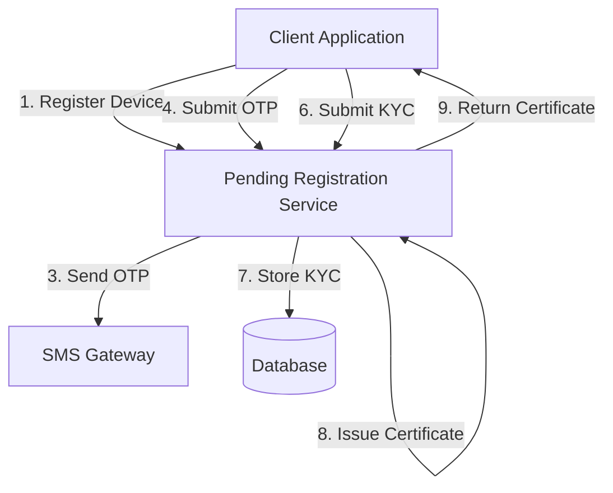

## 11. Developer Experience Improvements

### 11.1. Local Development Environment

**Issue**: The application lacks a standardized local development environment, making it difficult for new developers to get started.

**Recommendation**: Implement a Docker Compose setup for local development:

```yaml
# docker-compose.yml
version: '3.8'

services:
  postgres:
    image: postgres:16-alpine
    environment:
      POSTGRES_DB: online_banking_db
      POSTGRES_USER: postgres
      POSTGRES_PASSWORD: postgres
    ports:
      - "5432:5432"
    volumes:
      - postgres-data:/var/lib/postgresql/data
    healthcheck:
      test: ["CMD-SHELL", "pg_isready -U postgres"]
      interval: 5s
      timeout: 5s
      retries: 5

  redis:
    image: redis:7-alpine
    ports:
      - "6379:6379"
    volumes:
      - redis-data:/data
    healthcheck:
      test: ["CMD", "redis-cli", "ping"]
      interval: 5s
      timeout: 5s
      retries: 5

  mailhog:
    image: mailhog/mailhog
    ports:
      - "1025:1025"  # SMTP server
      - "8025:8025"  # Web UI

  prs:
    build:
      context: .
      dockerfile: Dockerfile.dev
    depends_on:
      postgres:
        condition: service_healthy
      redis:
        condition: service_healthy
    environment:
      SPRING_PROFILES_ACTIVE: dev
      SPRING_DATASOURCE_URL: jdbc:postgresql://postgres:5432/online_banking_db
      SPRING_DATASOURCE_USERNAME: postgres
      SPRING_DATASOURCE_PASSWORD: postgres
      SPRING_REDIS_HOST: redis
      SPRING_REDIS_PORT: 6379
      SPRING_MAIL_HOST: mailhog
      SPRING_MAIL_PORT: 1025
      SERVER_PRIVATE_KEY_JSON: ${SERVER_PRIVATE_KEY_JSON}
      SERVER_PUBLIC_KEY_JSON: ${SERVER_PUBLIC_KEY_JSON}
      JWT_ISSUER: local-dev
      JWT_EXPIRATION_TIME_MS: 3600000
      OTP_SALT: dev-salt
    ports:
      - "8080:8080"
      - "5005:5005"  # Remote debugging port
    volumes:
      - ./:/app
      - maven-repo:/root/.m2

volumes:
  postgres-data:
  redis-data:
  maven-repo:
```

Create a development Dockerfile:

```dockerfile
# Dockerfile.dev
FROM maven:3.9-eclipse-temurin-17

WORKDIR /app

# Copy Maven configuration
COPY pom.xml .
COPY prs/pom.xml prs/
COPY prs/prs-db-repository/pom.xml prs/prs-db-repository/
COPY prs/prs-rest-api/pom.xml prs/prs-rest-api/
COPY prs/prs-rest-server/pom.xml prs/prs-rest-server/
COPY prs/prs-service-api/pom.xml prs/prs-service-api/
COPY prs/prs-service-impl/pom.xml prs/prs-service-impl/

# Download dependencies
RUN mvn dependency:go-offline -B

# Copy source code
COPY . .

# Run with remote debugging enabled
CMD ["mvn", "spring-boot:run", "-Dspring-boot.run.jvmArguments='-agentlib:jdwp=transport=dt_socket,server=y,suspend=n,address=*:5005'"]
```

### 11.2. Testing Strategy

**Issue**: The application has limited test coverage and lacks a comprehensive testing strategy.

**Recommendation**: Implement a multi-layered testing approach with TestContainers:

```xml
<!-- Add to pom.xml -->
<dependency>
    <groupId>org.testcontainers</groupId>
    <artifactId>testcontainers</artifactId>
    <version>1.19.3</version>
    <scope>test</scope>
</dependency>
<dependency>
    <groupId>org.testcontainers</groupId>
    <artifactId>postgresql</artifactId>
    <version>1.19.3</version>
    <scope>test</scope>
</dependency>
<dependency>
    <groupId>org.testcontainers</groupId>
    <artifactId>junit-jupiter</artifactId>
    <version>1.19.3</version>
    <scope>test</scope>
</dependency>
```

Unit testing with JUnit 5 and Mockito:

```java
@ExtendWith(MockitoExtension.class)
class OtpServiceTest {
    
    @Mock
    private OtpRequestRepository otpRequestRepository;
    
    @Mock
    private SmsService smsService;
    
    @InjectMocks
    private OtpServiceImpl otpService;
    
    @Test
    void shouldGenerateAndSendOtp() {
        // Given
        JWK devicePub = mock(JWK.class);
        String phoneNumber = "+1234567890";
        OtpEntity otpEntity = new OtpEntity();
        otpEntity.setOtpCode("12345");
        
        when(devicePub.toJSONString()).thenReturn("{\"kty\":\"EC\",\"crv\":\"P-256\",\"x\":\"abc\",\"y\":\"def\"}");
        when(otpRequestRepository.findByPublicKeyHash(anyString())).thenReturn(Optional.empty());
        when(otpRequestRepository.save(any(OtpEntity.class))).thenReturn(otpEntity);
        
        // When
        String result = otpService.sendOtp(devicePub, phoneNumber);
        
        // Then
        assertNotNull(result);
        verify(smsService).sendSms(eq(phoneNumber), anyString());
        verify(otpRequestRepository).save(any(OtpEntity.class));
    }
}
```

Integration testing with TestContainers:

```java
@SpringBootTest
@Testcontainers
class OtpIntegrationTest {
    
    @Container
    static PostgreSQLContainer<?> postgres = new PostgreSQLContainer<>("postgres:16-alpine")
        .withDatabaseName("testdb")
        .withUsername("test")
        .withPassword("test");
    
    @DynamicPropertySource
    static void postgresProperties(DynamicPropertyRegistry registry) {
        registry.add("spring.datasource.url", postgres::getJdbcUrl);
        registry.add("spring.datasource.username", postgres::getUsername);
        registry.add("spring.datasource.password", postgres::getPassword);
    }
    
    @Autowired
    private OtpServiceApi otpService;
    
    @Autowired
    private OtpRequestRepository otpRequestRepository;
    
    @Test
    void shouldStoreOtpInDatabase() throws Exception {
        // Given
        JWK devicePub = JWK.parse("{\"kty\":\"EC\",\"crv\":\"P-256\",\"x\":\"abc\",\"y\":\"def\"}");
        String phoneNumber = "+1234567890";
        
        // When
        String otpHash = otpService.sendOtp(devicePub, phoneNumber);
        
        // Then
        assertNotNull(otpHash);
        
        // Verify OTP is stored in database
        String publicKeyHash = computePublicKeyHash(devicePub.toJSONString());
        Optional<OtpEntity> storedOtp = otpRequestRepository.findByPublicKeyHash(publicKeyHash);
        assertTrue(storedOtp.isPresent());
        assertEquals(OtpStatus.PENDING, storedOtp.get().getStatus());
    }
}
```

End-to-end testing with Playwright:

```java
@SpringBootTest(webEnvironment = SpringBootTest.WebEnvironment.DEFINED_PORT)
@Testcontainers
class OtpEndToEndTest {
    
    @Container
    static PostgreSQLContainer<?> postgres = new PostgreSQLContainer<>("postgres:16-alpine")
        .withDatabaseName("testdb")
        .withUsername("test")
        .withPassword("test");
    
    @DynamicPropertySource
    static void postgresProperties(DynamicPropertyRegistry registry) {
        registry.add("spring.datasource.url", postgres::getJdbcUrl);
        registry.add("spring.datasource.username", postgres::getUsername);
        registry.add("spring.datasource.password", postgres::getPassword);
    }
    
    private Playwright playwright;
    private Browser browser;
    private Page page;
    
    @BeforeEach
    void setUp() {
        playwright = Playwright.create();
        browser = playwright.chromium().launch();
        page = browser.newPage();
    }
    
    @AfterEach
    void tearDown() {
        if (page != null) {
            page.close();
        }
        if (browser != null) {
            browser.close();
        }
        if (playwright != null) {
            playwright.close();
        }
    }
    
    @Test
    void shouldCompleteOtpFlow() {
        // Navigate to OTP request page
        page.navigate("http://localhost:8080/otp-demo.html");
        
        // Fill phone number
        page.fill("#phoneNumber", "+1234567890");
        
        // Click request OTP button
        page.click("#requestOtp");
        
        // Wait for OTP field to be enabled
        page.waitForSelector("#otpCode:not([disabled])");
        
        // Fill OTP code (mocked in test environment)
        page.fill("#otpCode", "12345");
        
        // Click validate button
        page.click("#validateOtp");
        
        // Verify success message
        page.waitForSelector("#successMessage");
        assertTrue(page.isVisible("#successMessage"));
    }
}
```

### 11.3. CI/CD Pipeline

**Issue**: The application lacks a modern CI/CD pipeline for automated testing, building, and deployment.

**Recommendation**: Implement a GitHub Actions workflow:

```yaml
# .github/workflows/ci.yml
name: CI/CD Pipeline

on:
  push:
    branches: [ main, develop ]
  pull_request:
    branches: [ main, develop ]

jobs:
  build-and-test:
    runs-on: ubuntu-latest
    
    services:
      postgres:
        image: postgres:16-alpine
        env:
          POSTGRES_DB: testdb
          POSTGRES_USER: test
          POSTGRES_PASSWORD: test
        ports:
          - 5432:5432
        options: >-
          --health-cmd pg_isready
          --health-interval 10s
          --health-timeout 5s
          --health-retries 5
    
    steps:
    - uses: actions/checkout@v4
    
    - name: Set up JDK 17
      uses: actions/setup-java@v4
      with:
        java-version: '17'
        distribution: 'temurin'
        cache: maven
    
    - name: Build with Maven
      run: mvn -B package --file pom.xml
    
    - name: Run Tests
      run: mvn -B test
    
    - name: Run Integration Tests
      run: mvn -B verify -P integration-test
    
    - name: SonarQube Scan
      if: github.event_name != 'pull_request'
      run: mvn -B sonar:sonar -Dsonar.projectKey=webank-prs -Dsonar.host.url=${{ secrets.SONAR_URL }} -Dsonar.login=${{ secrets.SONAR_TOKEN }}
    
    - name: Build Docker Image
      run: |
        docker build -t webank-prs:${{ github.sha }} .
        docker tag webank-prs:${{ github.sha }} webank-prs:latest
    
    - name: Run Trivy vulnerability scanner
      uses: aquasecurity/trivy-action@master
      with:
        image-ref: 'webank-prs:latest'
        format: 'sarif'
        output: 'trivy-results.sarif'
    
    - name: Upload Trivy scan results
      uses: github/codeql-action/upload-sarif@v2
      with:
        sarif_file: 'trivy-results.sarif'
    
    - name: Login to GitHub Container Registry
      if: github.ref == 'refs/heads/main'
      uses: docker/login-action@v3
      with:
        registry: ghcr.io
        username: ${{ github.actor }}
        password: ${{ secrets.GITHUB_TOKEN }}
    
    - name: Push Docker Image
      if: github.ref == 'refs/heads/main'
      run: |
        docker tag webank-prs:latest ghcr.io/adorsys-gis/webank-prs:latest
        docker tag webank-prs:latest ghcr.io/adorsys-gis/webank-prs:${{ github.sha }}
        docker push ghcr.io/adorsys-gis/webank-prs:latest
        docker push ghcr.io/adorsys-gis/webank-prs:${{ github.sha }}
```

### 11.4. Documentation

**Issue**: The application lacks comprehensive documentation for developers.

**Recommendation**: Implement a documentation strategy with Markdown and diagrams:

```markdown
# WeBank Pending Registration Service

## Overview

The Pending Registration Service (PRS) is responsible for managing the secure registration of new users, their devices, and mobile phone numbers. It acts as a gatekeeper for new accounts, ensuring that only legitimate users with verified devices and phone numbers can access the Online Banking Service (OBS).

## Architecture



## Getting Started

### Prerequisites

- Java 17 or higher
- Docker and Docker Compose
- Maven 3.8 or higher

### Local Development

1. Clone the repository:
   ```bash
   git clone https://github.com/ADORSYS-GIS/webank-pending-registration-service.git
   cd webank-pending-registration-service
   ```

2. Start the development environment:
   ```bash
   docker-compose up -d
   ```

3. Run the application:
   ```bash
   mvn spring-boot:run -Dspring-boot.run.profiles=dev
   ```

4. Access the API documentation:
   ```
   http://localhost:8080/swagger-ui.html
   ```

## API Documentation

The PRS provides the following main API endpoints:

- `POST /api/v1/otp` - Generate and send OTP
- `POST /api/v1/otp/validate` - Validate OTP
- `POST /api/v1/kyc` - Submit KYC information
- `GET /api/v1/kyc/status` - Check KYC status
- `POST /api/v1/device/register` - Register a new device

For detailed API documentation, refer to the OpenAPI specification available at `/v3/api-docs`.