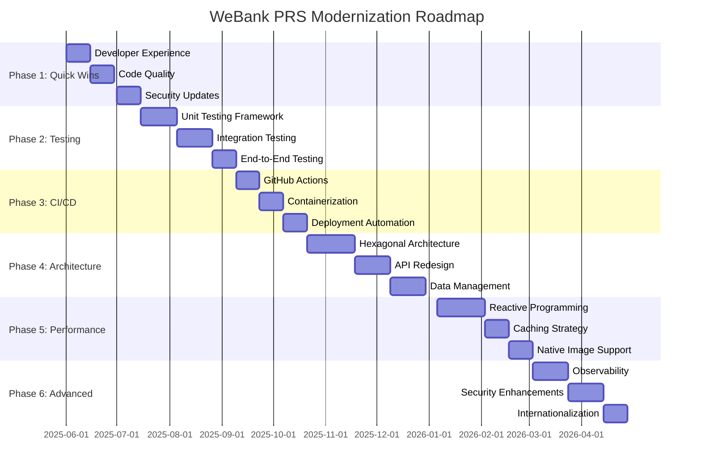

## 12. Implementation Roadmap

Based on the comprehensive review of the WeBank Pending Registration Service, we recommend the following phased implementation roadmap to modernize the application:

### Phase 1: Quick Wins (1-2 Months)

Focus on immediate improvements with high impact and low risk:

1. **Developer Experience Improvements**
   - Set up Docker Compose for local development
   - Implement comprehensive documentation
   - Configure IDE settings and code style

2. **Code Quality Enhancements**
   - Implement global exception handling
   - Add comprehensive logging
   - Fix code duplication issues

3. **Security Updates**
   - Update dependencies to latest versions
   - Implement security headers
   - Fix any critical vulnerabilities

### Phase 2: Testing Infrastructure (2-3 Months)

Build a robust testing infrastructure to support future changes:

1. **Unit Testing Framework**
   - Implement JUnit 5 with Mockito for all services
   - Set up test coverage reporting
   - Create test utilities and fixtures

2. **Integration Testing**
   - Implement TestContainers for database tests
   - Set up API contract tests
   - Create test data generators

3. **End-to-End Testing**
   - Set up Playwright for E2E tests
   - Implement critical user journey tests
   - Configure test reporting

### Phase 3: CI/CD Pipeline (1-2 Months)

Establish a modern CI/CD pipeline:

1. **GitHub Actions Workflow**
   - Configure build and test automation
   - Set up code quality checks
   - Implement security scanning

2. **Containerization**
   - Create optimized Docker images
   - Implement multi-stage builds
   - Configure container security scanning

3. **Deployment Automation**
   - Set up environment-specific deployments
   - Implement database migration automation
   - Configure monitoring and alerting

### Phase 4: Architecture Modernization (3-4 Months)

Gradually modernize the architecture:

1. **Hexagonal Architecture**
   - Refactor core services to use ports and adapters
   - Implement domain-driven design principles
   - Decouple business logic from infrastructure

2. **API Redesign**
   - Implement consistent RESTful API design
   - Add comprehensive OpenAPI documentation
   - Implement API versioning

3. **Data Management**
   - Implement Flyway for database migrations
   - Add caching with Redis
   - Optimize database queries

### Phase 5: Performance Optimization (2-3 Months)

Focus on performance improvements:

1. **Reactive Programming**
   - Migrate to Spring WebFlux
   - Implement reactive repositories with R2DBC
   - Refactor services for non-blocking operations

2. **Caching Strategy**
   - Implement multi-level caching
   - Add cache warming and invalidation
   - Configure cache metrics

3. **Native Image Support**
   - Configure GraalVM native image compilation
   - Optimize startup time and memory usage
   - Implement AOT compilation

### Phase 6: Advanced Features (3-4 Months)

Implement modern Spring Boot features:

1. **Observability**
   - Implement distributed tracing with OpenTelemetry
   - Add comprehensive metrics with Micrometer
   - Set up centralized logging

2. **Security Enhancements**
   - Migrate to OAuth2 Resource Server
   - Implement modern password hashing
   - Add comprehensive security testing

3. **Internationalization**
   - Implement message bundles for multiple languages
   - Add locale-specific formatting
   - Configure content negotiation

## Implementation Timeline

## Risk Assessment

| Risk | Impact | Likelihood | Mitigation |
|------|--------|------------|------------|
| Knowledge gaps in reactive programming | High | Medium | Provide training, start with small components, pair programming |
| Database migration issues | High | Medium | Comprehensive testing, rollback strategy, staged migration |
| Performance regression during refactoring | Medium | High | Establish performance baselines, automated performance testing |
| Security vulnerabilities during transition | High | Low | Security scanning in CI/CD, regular penetration testing |
| Extended downtime during deployment | High | Low | Blue-green deployment, feature flags, gradual rollout |

## Success Metrics

To measure the success of the modernization effort, we recommend tracking the following metrics:

1. **Performance Metrics**
   - Application startup time (target: < 2 seconds)
   - API response time (target: p95 < 200ms)
   - Memory usage (target: 30% reduction)
   - Throughput (target: 2x improvement)

2. **Developer Experience Metrics**
   - Build time (target: < 1 minute)
   - Test execution time (target: < 3 minutes)
   - Code coverage (target: > 80%)
   - Developer onboarding time (target: < 1 day)

3. **Operational Metrics**
   - Deployment frequency (target: daily)
   - Change failure rate (target: < 5%)
   - Mean time to recovery (target: < 30 minutes)
   - Infrastructure cost (target: 20% reduction)

## Conclusion

The WeBank Pending Registration Service is a critical component of the banking infrastructure, and modernizing it will provide significant benefits in terms of performance, scalability, security, and developer experience. By following this phased approach, the team can minimize risk while incrementally delivering value.

The proposed roadmap balances quick wins with strategic long-term improvements, ensuring that the application remains stable and secure throughout the modernization process. Regular reviews and adjustments to the plan will be necessary as the team gains experience with the new technologies and approaches.

With proper planning, testing, and execution, the modernized PRS will be well-positioned to meet the evolving needs of WeBank's customers and developers for years to come.